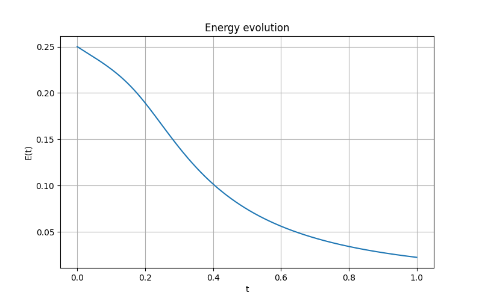
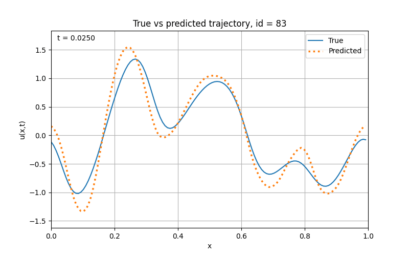
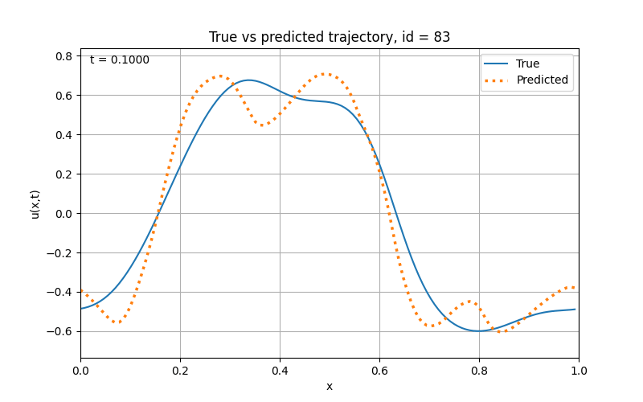

# Classical ML Surrogates for the 1D Burgers Equation

This project studies how classical machine learning models can learn the time evolution of a physical system governed by a partial differential equation.

The equation considered here is the 1D viscous Burgers equation:

$$
\partial_t u + u \partial_x u = \nu \partial_{xx}u
$$

where $u(x,t)$ is the state of the system and $\nu$ is the viscosity.

The goal is to generate reference trajectories with a numerical PDE solver, then train machine learning models to approximate the discrete time evolution:

$$
(u^n, \nu) \mapsto u^{n+k}
$$

where $u^n$ is the discretized solution at time step $n$, and $k$ is the prediction horizon.

## Numerical solver

The first part of the project builds a reference numerical solver for the 1D Burgers equation.

The solver uses:

- Rusanov flux for the nonlinear transport term
- central finite differences for the diffusion term
- RK4 time integration
- periodic boundary conditions for the machine learning experiments

This solver is used to generate supervised learning data for the machine learning part.

## Preliminary solver results

The following animations show the numerical evolution of the Burgers equation for two different initial conditions.

The left animation uses a periodic sinusoidal initial condition:

$$
u(x,0)=\sin(2\pi x)
$$

The right animation uses a localized Gaussian initial condition:

$$
u(x,0)=\exp(-x^2/2)
$$

<table>
  <tr>
    <td align="center"><b>Sinusoidal initial condition</b></td>
    <td align="center"><b>Gaussian initial condition</b></td>
  </tr>
  <tr>
    <td align="center">
      
    </td>
    <td align="center">
      
    </td>
  </tr>
</table>

## Energy decay

As an additional validation step, the discrete energy of the solution is computed over time:

$$
E^n = \frac{1}{2}\sum_i (u_i^n)^2 \Delta x
$$

For the viscous Burgers equation, viscosity should dissipate energy over time. Therefore, a decreasing energy curve is a useful sanity check for the numerical solver.

  

The observed energy decay confirms that the solver captures the expected dissipative behavior for the sinusoidal periodic initial condition.

## Machine learning formulation

The machine learning task is formulated as a supervised regression problem.

For each trajectory, the input is the current discretized state of the PDE and the viscosity:

$$
X = (u_0^n, u_1^n, \ldots, u_{N-1}^n, \nu)
$$

The target is the future state after a fixed prediction horizon:

$$
Y = (u_0^{n+k}, u_1^{n+k}, \ldots, u_{N-1}^{n+k})
$$

The prediction horizon is controlled by `store_every`. Larger values correspond to harder long-horizon prediction tasks.

Random periodic initial conditions are generated as finite Fourier series:

$$
u(x,0)=\sum_{j=1}^{5} a_j \sin(2\pi j x + \theta_j)
$$

where the amplitudes $a_j$, phases $\theta_j$, and viscosity $\nu$ are sampled randomly.

## Evaluation strategy

Two models are compared:

- **Persistence baseline**: predicts that the solution does not change, $\hat{u}^{n+k}=u^n$
- **Ridge regression**: a regularized linear model trained to predict $u^{n+k}$ from $(u^n,\nu)$

To avoid data leakage, the train/validation split is performed by `trajectory_id`. This ensures that all samples from the same trajectory stay in the same split.

Ridge hyperparameters are selected using `GroupKFold`, where each group corresponds to one full trajectory.

The models are evaluated with:

- Mean squared error
- Relative L2 error

The relative L2 error is defined as:

$$
\frac{\lVert y_{\text{true}} - y_{\text{pred}} \rVert_2}{\lVert y_{\text{true}} \rVert_2}
$$

## Ridge regression baseline

The table below compares the persistence baseline and Ridge regression for different prediction horizons.

All results are evaluated on unseen validation trajectories.

| `store_every` | Time horizon | Persistence rel. L2 | Ridge rel. L2 |
|---:|---:|---:|---:|
| 100 | 0.010 | 0.134 | 0.106 |
| 250 | 0.025 | 0.330 | 0.224 |
| 500 | 0.050 | 0.623 | 0.338 |
| 1000 | 0.100 | 1.115 | 0.444 |

Ridge regression consistently improves over the persistence baseline. However, as the prediction horizon increases, the linear model starts to lose local nonlinear structure.

This is expected: the Burgers equation contains a nonlinear transport term, so a purely linear model can capture part of the global trend but struggles with longer-horizon nonlinear deformation.

## Prediction examples

The following figures show the first prediction frame for the same validation trajectory.

Using the same trajectory makes the comparison easier to interpret: the difference between the two figures comes from the prediction horizon, not from a different initial condition.

<table>
  <tr>
    <td align="center"><b>Intermediate horizon: store_every = 250</b></td>
    <td align="center"><b>Long horizon: store_every = 1000</b></td>
  </tr>
  <tr>
    <td align="center">
      
    </td>
    <td align="center">
      
    </td>
  </tr>
</table>

For the intermediate horizon, Ridge regression captures the global evolution reasonably well, while already smoothing some local variations.

For the longer horizon, the prediction task is significantly harder. Ridge still improves over the persistence baseline, but it no longer follows the local nonlinear deformation accurately.

At later times, viscosity dissipates high-frequency structures and the solution becomes smoother. In that regime, Ridge predictions become more accurate again. The first-frame comparison is therefore the most informative view of the model's ability to capture nonlinear dynamics.

## Next steps

The next step is to move from a linear baseline to nonlinear classical machine learning models.

Planned models include:

- Polynomial Ridge regression
- PCA + Ridge
- PCA + nonlinear regression
- Kernel Ridge regression

The goal is to test whether nonlinear feature maps can better capture the nonlinear dynamics of the Burgers equation while staying within a classical machine learning framework.
