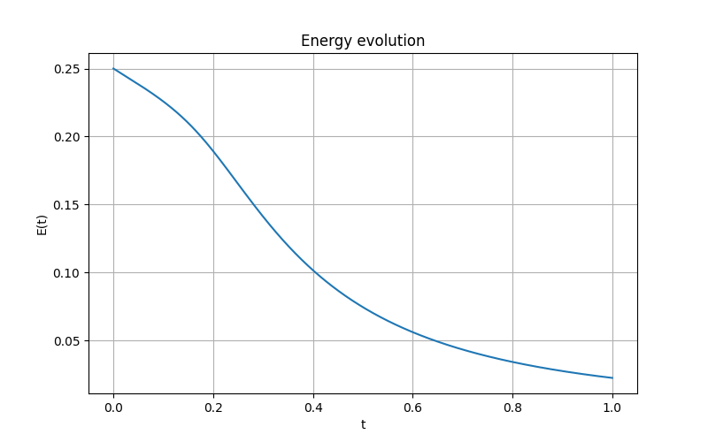
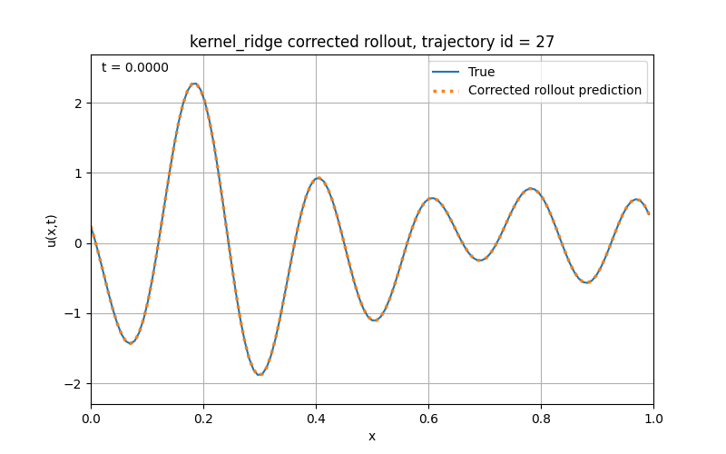

# Classical ML Surrogates for the 1D Burgers Equation

This project studies whether classical machine learning models can learn the time evolution of a nonlinear physical system governed by a partial differential equation.

The test case is the 1D viscous Burgers equation:

```math
\partial_t u + u \partial_x u = \nu \partial_{xx} u
```

where $u(x,t)$ is the state of the system and $\nu$ is the viscosity.

The goal is to generate reference trajectories with a numerical solver, then train classical machine learning models to approximate the discrete evolution operator:

```math
(u^n, \nu) \mapsto u^{n+k}
```

where $u^n$ is the discretized solution at time step $n$, and $k$ is the prediction horizon.

---

## Numerical solver

Reference trajectories are generated with a numerical solver using:

- Rusanov flux for the nonlinear transport term;
- central finite differences for the diffusion term;
- RK4 time integration;
- periodic boundary conditions.

The solver is first validated on simple initial conditions.

<table>
  <tr>
    <td align="center"><b>Sinusoidal initial condition</b></td>
    <td align="center"><b>Localized Gaussian initial condition</b></td>
  </tr>
  <tr>
    <td align="center">
      
    </td>
    <td align="center">
      
    </td>
  </tr>
</table>

For the viscous Burgers equation, viscosity dissipates energy over time. The discrete energy is computed as:

```math
E^n = \frac{1}{2}\sum_i (u_i^n)^2 \Delta x
```

<p align="center">
  
</p>

The observed decay confirms that the solver captures the expected dissipative behavior.

---

## Machine learning formulation

The machine learning task is formulated as supervised regression.

Each input sample is:

```math
X = (u_0^n, u_1^n, \ldots, u_{N-1}^n, \nu)
```

and the target is:

```math
Y = (u_0^{n+k}, u_1^{n+k}, \ldots, u_{N-1}^{n+k})
```

Random periodic initial conditions are generated as finite Fourier series:

```math
u(x,0) = \sum_{j=1}^{5} a_j \sin(2\pi jx + \theta_j)
```

where the amplitudes $a_j$, phases $\theta_j$, and viscosity $\nu$ are sampled randomly.

The train/validation split is performed by trajectory ID, so that all states from the same trajectory remain in the same split.

---

## Models tested

Several classical machine learning approaches were tested.

| Model / idea | Outcome |
|---|---|
| Persistence baseline | Useful sanity check, but poor rollout accuracy |
| Linear Ridge | Strong simple baseline |
| Polynomial Ridge | Did not improve the results |
| Kernel Ridge Regression | Best standalone model |
| HistGradientBoosting Regressor | Did not outperform Kernel Ridge as a direct predictor |
| Residual learning | Did not improve rollout stability |
| PDE-inspired features | Improved some one-step results, but not rollout |
| HGB residual correction | Small improvement over Kernel Ridge |
| Amplitude calibration | Best final improvement for rollout accuracy |

The final retained model combines Kernel Ridge Regression, HGB residual correction, and amplitude calibration.

---

## Amplitude calibration

Kernel Ridge Regression with HGB residual correction captured the global shape of the solution and the spatial position of the peaks, but it still underestimated peak amplitudes.

Let the corrected prediction before amplitude calibration be:

```math
\tilde{u}^{n+k}
=
\hat{u}_{\mathrm{KRR}}^{n+k}
+
\hat{e}_{\mathrm{HGB}}^{n+k}
```

where $\hat{e}_{\mathrm{HGB}}^{n+k}$ is the residual predicted by the HGB correction model.

The final prediction is obtained by scaling the deviation from the spatial mean:

```math
\hat{u}_{\mathrm{final}}^{n+k}
=
\bar{u}^n
+
c
\left(
\tilde{u}^{n+k}
-
\bar{u}^n
\right)
```

with

```math
\bar{u}^n
=
\frac{1}{N}
\sum_{i=0}^{N-1} u_i^n
```

The scalar $c$ is fitted on validation predictions by least squares:

```math
c
=
\frac{
\sum_s
\left\langle
\tilde{u}_s^{n+k} - \bar{u}_s^n,
u_{s,\mathrm{true}}^{n+k} - \bar{u}_s^n
\right\rangle
}{
\sum_s
\left\lVert
\tilde{u}_s^{n+k} - \bar{u}_s^n
\right\rVert_2^2
}
```

This correction was added because the model was already predicting the correct global shape and peak locations, but its amplitudes were too conservative. Scaling around the spatial mean boosts peaks and valleys without shifting the whole solution vertically.

---

## Evaluation

Models are evaluated using the relative L2 error:

```math
\frac{
\lVert y_{\mathrm{true}} - y_{\mathrm{pred}} \rVert_2
}{
\lVert y_{\mathrm{true}} \rVert_2
}
```

Two evaluation modes are used:

- one-step prediction error, where the model predicts one future state;
- rollout error, where the model is recursively applied to simulate a trajectory.

Rollout error is the most important metric because it measures whether the learned model remains stable when its own predictions are fed back as inputs.

---

## Main results

The main experiment uses:

- grid size: $N = 128$;
- prediction horizon: `store_every = 250`;
- periodic random Fourier initial conditions;
- validation split by trajectory.

Representative validation results:

| Model | One-step relative L2 | Rollout relative L2 |
|---|---:|---:|
| Persistence | 0.506 | 7.55 |
| Linear Ridge | 0.277 | 0.707 |
| Kernel Ridge | 0.248 | 0.650 |
| Kernel Ridge + HGB correction | — | 0.610 |
| Kernel Ridge + HGB correction + amplitude calibration | — | **0.490** |

The final model improves rollout accuracy compared to direct Kernel Ridge Regression.

---

## Final rollout

The animation below shows the final model rollout on an unseen validation trajectory.

<p align="center">
  
</p>

The model captures the global shape of the solution, the direction of evolution, and the spatial position of the main peaks. The main remaining limitation is that peak amplitudes are still underestimated.

---

## Status

This project is paused after completing a first clean classical ML surrogate pipeline.

The final retained model is:

```math
\text{Kernel Ridge}
+
\text{HGB residual correction}
+
\text{amplitude calibration}
```

This provides a baseline for future experiments with PCA/POD representations, Fourier features, rollout-aware training, or neural surrogate models.
