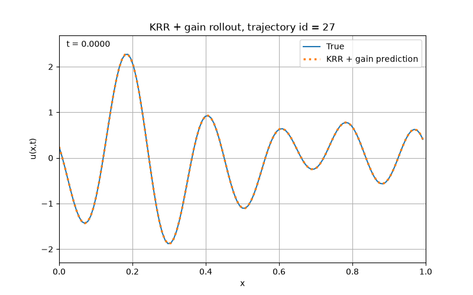
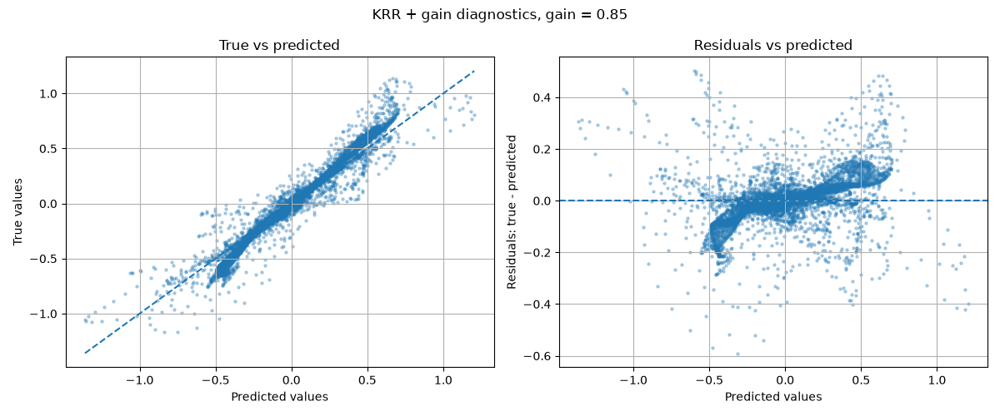

# Classical ML Surrogates for the 1D Burgers Equation

This repository studies whether lightweight classical machine learning models can approximate the time evolution of a nonlinear PDE when trained directly on raw spatial grid states.

The test case is the one-dimensional viscous Burgers equation:

```math
\partial_t u + u\,\partial_x u = \nu\,\partial_{xx}u
```

The objective is to learn a discrete flow map:

```math
(u^n, \nu) \mapsto u^{n+k}
```

where `u^n` is the discretized solution at time step `n`, `nu` is the viscosity, and `k` is the prediction horizon.

This repository is Part I of a larger project. The goal is to build a clean raw-grid classical ML baseline, evaluate its rollout behavior, and identify its main limitations.

---

## Numerical solver

Reference trajectories are generated using:

- Rusanov flux for the nonlinear convection term;
- central finite differences for the diffusion term;
- RK4 time integration;
- periodic boundary conditions.

The solver is first checked on simple initial conditions.

<table>
  <tr>
    <td align="center"><b>Sinusoidal initial condition</b></td>
    <td align="center"><b>Localized Gaussian initial condition</b></td>
  </tr>
  <tr>
    <td align="center">
      
    </td>
    <td align="center">
      
    </td>
  </tr>
</table>

For the viscous Burgers equation, the discrete energy is expected to decay over time:

```math
E^n = \frac{1}{2}\sum_i (u_i^n)^2\Delta x
```

<p align="center">
  
</p>

This decay is used as a sanity check that the solver captures the dissipative behavior of viscous Burgers dynamics.

---

## Dataset and learning task

Random periodic initial conditions are generated as finite Fourier sums:

```math
u(x,0) = \sum_{j=1}^{5} a_j\sin(2\pi jx + \theta_j)
```

Each supervised input is:

```math
X = (u_0^n, u_1^n, \ldots, u_{N-1}^n, \nu)
```

and the target is:

```math
Y = (u_0^{n+k}, u_1^{n+k}, \ldots, u_{N-1}^{n+k})
```

The split is performed by `trajectory_id`, so that all states from the same trajectory remain in the same split. This avoids leakage between training and validation.

Main experimental parameters:

| Parameter | Value |
|---|---:|
| Grid size | `N = 128` |
| Time step | `delta_t = 1e-4` |
| Solver steps | `5000` |
| Final time | `T = 0.5` |
| Prediction horizon | `store_every = 250` |
| Physical prediction time | `0.025` |
| Number of trajectories | `30` |
| Train / validation trajectories | `25 / 5` |
| Viscosity values | `[0.01, 0.02, 0.05, 0.1]` |
| Random seed | `42` |

The prediction horizon corresponds to:

```math
250 \times 10^{-4} = 0.025
```

---

## Models

The tested classical models are:

- Persistence baseline;
- Linear Ridge regression;
- Polynomial Ridge regression;
- Kernel Ridge regression with RBF kernel;
- Kernel Ridge with HGB residual correction;
- Kernel Ridge with rollout-calibrated amplitude gain.

Kernel Ridge Regression is used as the main baseline because it gives the best standalone one-step validation error among the tested classical models:

```math
\hat{u}_{\mathrm{KRR}}^{n+k}
=
f_{\mathrm{KRR}}(u^n,\nu)
```

---

## Residual-correction ablation

After fitting Kernel Ridge, a second model was tested to correct the residual error left by the baseline predictor.

Let the true discrete flow map be denoted by:

```math
F_k(u^n,\nu) = u^{n+k}
```

Kernel Ridge gives a first approximation:

```math
\hat{u}_{\mathrm{KRR}}^{n+k}
=
f_{\mathrm{KRR}}(u^n,\nu)
```

The residual left by this baseline is:

```math
e^{n+k}
=
F_k(u^n,\nu)
-
f_{\mathrm{KRR}}(u^n,\nu)
```

A residual model can then be trained to approximate:

```math
\hat{e}^{n+k}
\approx
e^{n+k}
```

and the corrected prediction becomes:

```math
\tilde{u}^{n+k}
=
\hat{u}_{\mathrm{KRR}}^{n+k}
+
\hat{e}^{n+k}
```

HistGradientBoosting was tested for this correction because it is a classical non-neural nonlinear regressor. The motivation was to check whether the residual left by Kernel Ridge still contains nonlinear structure that can be learned from the current state, the viscosity, and the KRR prediction:

```math
\mathbb{E}
\left[
e^{n+k}
\mid
u^n,\nu,\hat{u}_{\mathrm{KRR}}^{n+k}
\right].
```

However, this correction was not robust in validation. It improved one selected rollout trajectory, but it worsened both one-step prediction error and mean validation rollout error.

| Model | One-step MSE | One-step relative L2 |
|---|---:|---:|
| Kernel Ridge | **0.003978** | **0.248** |
| Kernel Ridge + HGB correction | 0.004418 | 0.261 |

No gain is applied in this table. It compares the raw one-step predictors only.

The no-gain rollout ablation gives:

| Model | Selected rollout relative L2 | Mean validation rollout relative L2 |
|---|---:|---:|
| Kernel Ridge | 0.650 | **0.772** |
| Kernel Ridge + HGB correction | **0.611** | 0.821 |

Therefore, HGB residual correction is treated as an ablation, not as the final selected model.

---

## Rollout-calibrated amplitude gain

During rollout, the model is recursively applied. Small amplitude errors can accumulate because the model feeds its own predictions back as future inputs.

For the final model, a scalar gain is applied to the deviation from the initial spatial mean:

```math
\hat{u}_{\mathrm{final}}^{n+k}
=
\bar{u}^0
+
g
\left(
\hat{u}_{\mathrm{KRR}}^{n+k}
-
\bar{u}^0
\right)
```

where

```math
\bar{u}^0
=
\frac{1}{N}
\sum_{i=0}^{N-1} u_i^0.
```

The gain is selected by validation rollout error minimization:

```math
g^\star
=
\arg\min_g
\frac{
\left\lVert
u_{\mathrm{true}}^{\mathrm{rollout}}
-
u_{\mathrm{pred}}^{\mathrm{rollout}}(g)
\right\rVert_2
}{
\left\lVert
u_{\mathrm{true}}^{\mathrm{rollout}}
\right\rVert_2
}.
```

The tested values were:

```math
g \in \{0.50, 0.55, 0.60, \ldots, 1.50\}.
```

The selected rollout gain was:

```math
g^\star = 0.85.
```

For Kernel Ridge without HGB, this gives a mean validation rollout relative L2 of:

```math
0.612.
```

The selected gain slightly damps amplitudes. It is not chosen from the displayed trajectory; it is selected from mean validation rollout performance.

---

## Evaluation

The main metric is the relative L2 error:

```math
\frac{
\lVert u_{\mathrm{true}} - u_{\mathrm{pred}} \rVert_2
}{
\lVert u_{\mathrm{true}} \rVert_2
}.
```

Two evaluation regimes are used:

- **one-step prediction**, where the model predicts one future state;
- **rollout prediction**, where the model is recursively applied to generate a full trajectory.

Rollout evaluation is the more important test because errors compound when the model uses its own predictions as future inputs.

---

## Results

One-step validation errors, without gain:

| Model | One-step MSE | One-step relative L2 |
|---|---:|---:|
| Persistence | 0.016540 | 0.506 |
| Linear Ridge | 0.004955 | 0.277 |
| Polynomial Ridge | 0.011814 | 0.427 |
| Kernel Ridge | **0.003978** | **0.248** |
| Kernel Ridge + HGB correction | 0.004418 | 0.261 |
| Kernel Ridge + gain | 0.004363 | 0.260 |

The gain is selected for rollout, not for one-step prediction. This is why Kernel Ridge remains the best one-step model, while Kernel Ridge + gain is evaluated mainly as a rollout model.

Rollout validation errors:

| Model | Selected rollout relative L2 | Mean validation rollout relative L2 |
|---|---:|---:|
| Kernel Ridge, no gain | 0.650 | 0.772 |
| Kernel Ridge + HGB, no gain | 0.611 | 0.821 |
| Kernel Ridge + HGB + gain | **0.455** | 0.629 |
| Kernel Ridge + gain, no HGB | 0.464 | **0.612** |

The best selected trajectory is obtained by Kernel Ridge + HGB + gain, but the best mean validation rollout error is obtained by Kernel Ridge + gain without HGB.

The final selected model is therefore:

```math
\text{Kernel Ridge + rollout-calibrated gain}.
```

This choice is based on mean validation rollout error, not on a single favorable trajectory.

---

## Final rollout

The animation below shows the evolution predicted by the final Kernel Ridge + gain model against the reference numerical trajectory on an unseen validation trajectory.

<p align="center">
  
</p>

The selected trajectory rollout relative L2 is:

```math
0.464.
```

The model captures the qualitative form of the solution, including the global shape and peak locations, but still exhibits amplitude and long-horizon rollout errors.

---

## Diagnostic plot

Pointwise diagnostic plots are used to inspect calibration errors beyond global relative L2.

<p align="center">
  
</p>

The left panel compares predicted and true grid values for the Kernel Ridge + gain model. Most points lie close to the diagonal, showing that the model learns the dominant short-time flow map. The dispersion increases away from the central region, which means that prediction errors are larger near high-amplitude regions than around moderate solution values.

The right panel shows residuals:

```math
r = u_{\mathrm{true}} - u_{\mathrm{pred}}.
```

The residuals are centered near zero for moderate predicted values, but they become more dispersed near larger positive and negative amplitudes. This indicates that the remaining error is state-dependent rather than purely random. In particular, extrema are harder to calibrate than the central part of the solution.

This explains why one-step relative L2 alone is not sufficient: the model can achieve a good global error while still making structured amplitude errors that matter during recursive rollout.

---

## Prediction cost

A useful surrogate should be faster than recomputing the PDE solution. After training, prediction time was compared with recomputing the same validation trajectories numerically.

| Method | Time on validation trajectories | Speedup vs solver |
|---|---:|---:|
| Kernel Ridge, no gain | 0.259 s | 102.34x |
| Kernel Ridge + gain | **0.238 s** | **111.53x** |
| Numerical solver | 26.54 s | 1.00x |

The final Kernel Ridge + gain model is substantially faster than recomputing the numerical solver on the validation trajectories.

---

## Interpretation and next step

This repository establishes a first raw-grid classical ML baseline for Burgers surrogate modeling.

The main findings are:

1. Classical ML can approximate short-horizon Burgers evolution.
2. One-step error is not sufficient to judge surrogate quality.
3. HGB residual correction is not a robust improvement in this experiment.
4. Rollout-calibrated gain improves mean validation rollout error.
5. Kernel Ridge + gain is the best final model among the tested variants.
6. The final model is much faster than recomputing the numerical solver on the validation trajectories.

The next part of the project will study whether reduced-coordinate representations improve classical ML rollouts. In particular, it will compare raw-grid states with PCA/POD coefficients and Fourier coefficients, using rollout error, extrema error, energy decay, spectral error, and prediction time.

---

## Status

This repository completes Part I of the project:

```math
\text{Raw-grid classical ML baseline for Burgers surrogate modeling}
```

The final selected model is:

```math
\text{Kernel Ridge + rollout-calibrated gain}.
```

The conclusion is:

```math
\text{Classical ML can learn meaningful Burgers dynamics, but raw-grid rollouts still exhibit structured amplitude errors.}
```
