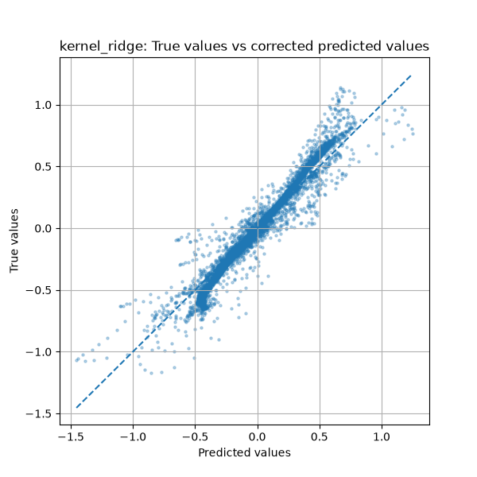
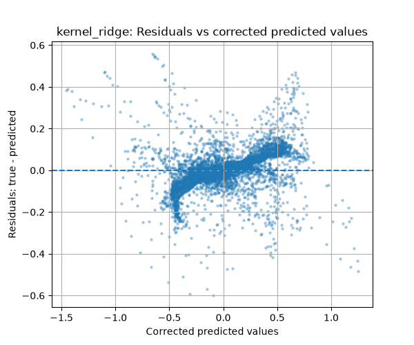

# Classical ML Surrogates for the 1D Burgers Equation

This project studies whether classical machine learning models can learn the time evolution of a nonlinear physical system governed by a partial differential equation.

The test case is the 1D viscous Burgers equation:

```math
\partial_t u + u \partial_x u = \nu \partial_{xx} u
```

where `u(x,t)` is the state of the system and `nu` is the viscosity.

The goal is to generate reference trajectories with a numerical solver, then train classical machine learning models to approximate the discrete evolution operator:

```math
(u^n, \nu) \mapsto u^{n+k}
```

where `u^n` is the discretized solution at time step `n`, and `k` is the prediction horizon.

This repository is Part I of a larger project. Its goal is not to claim that the current model is already an optimal surrogate, but to establish a clean raw-grid classical ML baseline and identify its main failure modes.

---

## Numerical solver

Reference trajectories are generated with a finite-volume / finite-difference solver using:

- Rusanov flux for the nonlinear transport term;
- central finite differences for the diffusion term;
- RK4 time integration;
- periodic boundary conditions.

The solver is first checked on simple initial conditions.

<table>
  <tr>
    <td align="center"><b>Sinusoidal initial condition</b></td>
    <td align="center"><b>Localized Gaussian initial condition</b></td>
  </tr>
  <tr>
    <td align="center">
      
    </td>
    <td align="center">
      
    </td>
  </tr>
</table>

For the viscous Burgers equation, viscosity dissipates energy over time. The discrete energy is computed as:

```math
E^n = \frac{1}{2}\sum_i (u_i^n)^2 \Delta x
```

<p align="center">
  
</p>

The observed decay confirms that the solver captures the expected dissipative behavior.

---

## Machine learning formulation

The machine learning task is formulated as supervised regression.

Each input sample is:

```math
X = (u_0^n, u_1^n, \ldots, u_{N-1}^n, \nu)
```

and the target is:

```math
Y = (u_0^{n+k}, u_1^{n+k}, \ldots, u_{N-1}^{n+k})
```

Random periodic initial conditions are generated as finite Fourier series:

```math
u(x,0) = \sum_{j=1}^{5} a_j \sin(2\pi jx + \theta_j)
```

where the amplitudes `a_j`, phases `theta_j`, and viscosity `nu` are sampled randomly.

The split is performed by `trajectory_id`, so all states from the same trajectory remain in the same split. This avoids leakage between training and validation.

---

## Experimental setup

The main experiment uses:

| Parameter | Value |
|---|---:|
| Grid size | `N = 128` |
| Time step | `delta_t = 1e-4` |
| Solver steps | `5000` |
| Final time | `T = 0.5` |
| Prediction horizon | `store_every = 250` |
| Number of trajectories | `30` |
| Training trajectories | `25` |
| Validation trajectories | `5` |
| Viscosity values | `[0.01, 0.02, 0.05, 0.1]` |
| Random seed | `42` |
| Fixed rollout gain | `0.85` |

The prediction horizon corresponds to:

```math
k\Delta t = 250 \times 10^{-4} = 0.025
```

---

## Models tested

Several classical machine learning approaches were tested.

| Model / idea | Outcome |
|---|---|
| Persistence baseline | Useful sanity check, but poor rollout accuracy |
| Linear Ridge | Strong simple baseline |
| Polynomial Ridge | Did not improve results |
| Kernel Ridge Regression | Best standalone one-step model |
| HistGradientBoosting Regressor | Did not outperform Kernel Ridge as a direct model |
| HGB residual correction | Added on top of Kernel Ridge |
| Amplitude gain calibration | Improved rollout error on the selected validation rollout |

The final retained model is:

```math
\text{Kernel Ridge}
+
\text{HGB residual correction}
+
\text{rollout-calibrated amplitude gain}
```

---

## Residual correction

Kernel Ridge Regression first predicts:

```math
\hat{u}_{\mathrm{KRR}}^{n+k}
```

A correction model is then trained to predict the residual:

```math
e^{n+k}
=
u_{\mathrm{true}}^{n+k}
-
\hat{u}_{\mathrm{KRR}}^{n+k}
```

The corrected prediction is:

```math
\tilde{u}^{n+k}
=
\hat{u}_{\mathrm{KRR}}^{n+k}
+
\hat{e}_{\mathrm{HGB}}^{n+k}
```

where `HGB` is a multi-output HistGradientBoosting correction model.

In this experiment, the residual correction did not improve one-step error by itself, but it was kept because the corrected rollout combined with amplitude gain gave the best selected rollout result.

---

## Amplitude gain calibration

During rollout, the model is recursively applied. Small amplitude errors can accumulate when the model feeds its own predictions back as inputs.

The final rollout prediction applies a gain to the deviation from the spatial mean:

```math
\hat{u}_{\mathrm{final}}^{n+k}
=
\bar{u}^0
+
g
\left(
\tilde{u}^{n+k}
-
\bar{u}^0
\right)
```

with

```math
\bar{u}^0
=
\frac{1}{N}
\sum_{i=0}^{N-1} u_i^0
```

where `g` is a validation-calibrated rollout gain.

The one-step least-squares gain was:

```math
g_{\mathrm{one-step}} = 0.9329
```

For the final rollout model, the selected gain was:

```math
g_{\mathrm{rollout}} = 0.85
```

This means the final calibration slightly damps amplitudes rather than boosting them. The purpose is not to force larger peaks, but to improve rollout stability.

---

## Evaluation metrics

Models are evaluated using the relative L2 error:

```math
\frac{
\lVert y_{\mathrm{true}} - y_{\mathrm{pred}} \rVert_2
}{
\lVert y_{\mathrm{true}} \rVert_2
}
```

Two evaluation modes are used:

- **one-step prediction**, where the model predicts one future state;
- **rollout prediction**, where the model is recursively applied to generate a trajectory.

Rollout error is the most important metric because it measures whether the learned model remains stable when its own predictions are fed back as inputs.

---

## Main results

### One-step validation error

| Model | MSE | Relative L2 |
|---|---:|---:|
| Polynomial Ridge | 0.01181 | 0.427 |
| Linear Ridge | 0.00496 | 0.277 |
| Persistence | 0.01654 | 0.506 |
| Kernel Ridge | **0.00398** | **0.248** |
| Kernel Ridge + HGB correction | 0.00442 | 0.261 |

Kernel Ridge Regression is the best standalone one-step predictor.

### Rollout results

| Model | Rollout relative L2 |
|---|---:|
| Persistence | 7.55 |
| Linear Ridge | 0.707 |
| Kernel Ridge | 0.650 |
| Kernel Ridge + HGB correction + gain, selected trajectory | **0.455** |
| Kernel Ridge + HGB correction + gain, mean validation rollout | 0.629 |

The final corrected model improves the selected rollout compared with raw Kernel Ridge. However, the mean validation rollout error remains significant.

---

## Final rollout

The animation below shows the final corrected rollout on an unseen validation trajectory.

<p align="center">
  
</p>

The model captures the qualitative Burgers evolution: global shape, smoothing behavior, and peak location are often reasonable. However, the rollout remains imperfect, especially in amplitude calibration and long-horizon stability.

---

## Diagnostic plots

The final model is also evaluated through pointwise diagnostic plots.

<p align="center">
  
</p>

This plot compares predicted values against true values over the validation set. A perfect model would lie on the diagonal.

<p align="center">
  
</p>

The residual plot shows:

```math
r = u_{\mathrm{true}} - u_{\mathrm{pred}}
```

as a function of the predicted value. This helps reveal whether errors are uniformly distributed or whether the model systematically miscalibrates large positive or negative amplitudes.

---

## Prediction speed benchmark

A practical surrogate should not only be accurate; it should also be faster than recomputing the numerical solution.

After training, the final model was used to predict all validation trajectories and compared with recomputing the same trajectories using the numerical solver.

| Method | Time for validation trajectories |
|---|---:|
| ML surrogate prediction | 704.28 s |
| Numerical solver | 65.26 s |
| Speedup | 0.09x |

In the current implementation, the surrogate is slower than the numerical solver.

This is mainly because the final model combines Kernel Ridge Regression, HGB residual correction, and raw-grid prediction. This is not an optimized deployment architecture.

The current repository should therefore be understood as a baseline and diagnostic study, not as a final efficient surrogate.

---

## Interpretation

This first part of the project establishes three things:

1. Classical ML models can learn meaningful short-horizon Burgers dynamics.
2. Recursive rollouts are much harder than one-step prediction.
3. Raw-grid classical surrogates can produce visually plausible trajectories while still failing in amplitude, stability, and efficiency.

The current model is therefore useful as a baseline, but not yet as a practical replacement for the numerical solver.

---

## Next step

The next part of the project will study whether the failure modes come partly from learning directly in raw physical grid coordinates.

The planned research question is:

```math
\text{Do reduced coordinates improve classical ML rollouts for Burgers dynamics?}
```

The next repository will compare:

- raw-grid states;
- PCA / POD coefficients;
- Fourier coefficients.

The evaluation will include not only relative L2, but also:

- extrema error;
- energy decay error;
- spectral error;
- rollout stability;
- prediction time.

The goal is to understand why raw-grid classical ML surrogates can predict the correct global form while still failing on physically important quantities such as peaks, energy, spectra, and long-horizon behavior.

---

## How to run

Install the required packages:

```bash
pip install -r requirements.txt
```

Then run:

```bash
python burgers_structured/main.py
```

The program will:

1. run a solver demo;
2. generate numerical Burgers trajectories;
3. train the classical ML models;
4. train the residual correction model;
5. apply the fixed rollout gain;
6. compare prediction time with numerical solving;
7. save the final rollout GIF;
8. show diagnostic plots.

---

## Status

This repository completes Part I of the project:

```math
\text{Raw-grid classical ML baseline for Burgers surrogate modeling}
```

The final conclusion is:

```math
\text{Classical ML can learn useful Burgers dynamics, but raw-grid corrected models are not yet accurate or efficient enough to be strong practical surrogates.}
```

Part II will focus on reduced-coordinate surrogate modeling and systematic failure-mode analysis.
